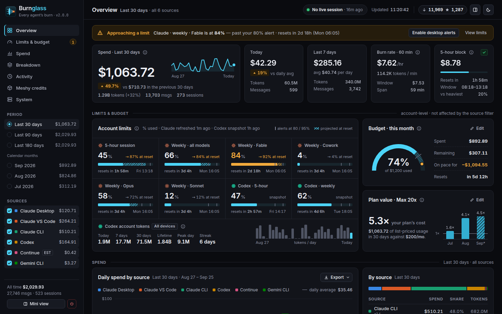
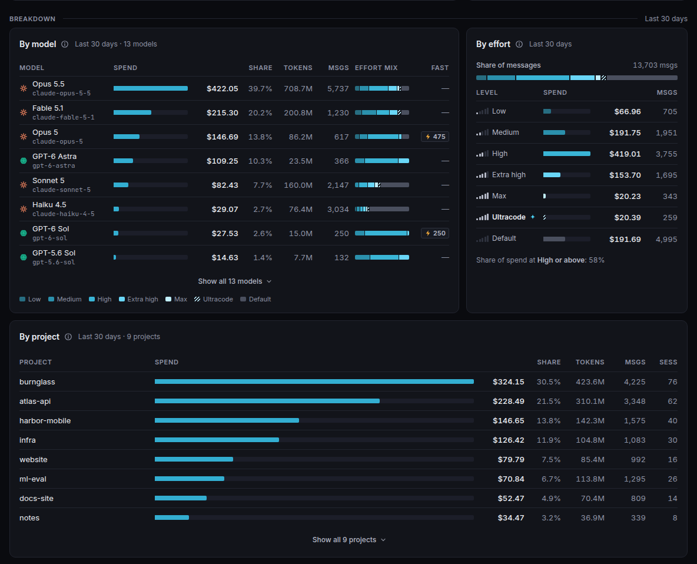
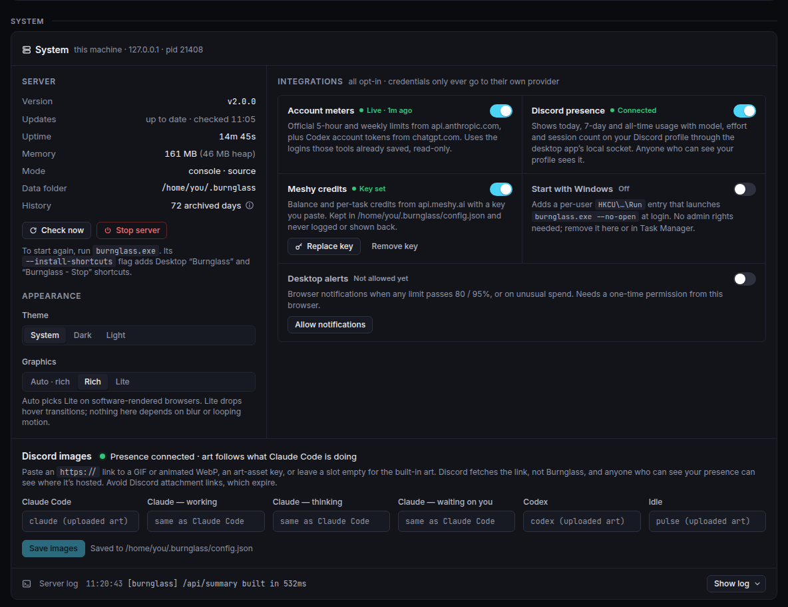

<div align="center">
  <picture>
    <source media="(prefers-color-scheme: light)" srcset=".github/assets/logo-light.svg" />
    
  </picture>

# Burnglass

<sub>formerly <b>Pulse</b> · every agent's burn, focused in one glass</sub>

**A live, local, zero-dependency usage dashboard for [Claude Code](https://claude.com/claude-code), [OpenAI Codex](https://github.com/openai/codex) and other coding agents.**

See what you're spending, which models you're spending it on, how close you are to
your 5-hour and weekly limits, when you work, and which sessions ran at which
reasoning effort. Burnglass reads the logs already on your machine: Claude Code, Codex,
Gemini CLI, Continue, Cline, Roo Code, or your own tool's JSONL. It ships as one
small executable, needs no configuration, and your usage data never leaves your computer.

[](https://github.com/ReFxFrank/Burnglass/releases/latest)
[](https://github.com/ReFxFrank/Burnglass/releases)
[](LICENSE)
[](https://github.com/ReFxFrank/Burnglass/releases/latest)
[](package.json)

  
</div>

---

> **New in v2.0: Pulse is now Burnglass.** A redesigned Command Center dashboard
> (left-rail navigation, a light theme, every limit in one grid), the new Glass
> look, and tray icons that follow your alert thresholds. Updating from Pulse is
> one click: your settings are copied to `~/.burnglass`, `~/.pulse` stays as a
> backup, and your Claude Code status line and effort hook keep working. See
> [Upgrading from Pulse](#-upgrading-from-pulse) and the full
> [CHANGELOG.md](CHANGELOG.md).

## ✨ Features

**Track your spend**
- 💸 **Live spend**: the current 5-hour block with its reset countdown, burn rate, today,
  the last 7 days, and a stacked 30-day spend chart. Refreshes every 10 seconds.
- 📅 **Any period**: rolling 30 / 90 / 180 days or any calendar month, with a
  *▲ 18% vs prev 30 days* comparison against the previous equal window.
- 🤖 **Breakdowns** by model (with provider logos), source, reasoning effort and project,
  plus a recent-sessions table. **Source checkboxes** in the rail scope the whole
  dashboard to any mix of tools.
- 🕒 **"When you work" heatmap**: a 7×24 day-by-hour grid shaded by spend.
- 🧮 **Honest extras**: what prompt caching saved you *net* of cache-write costs, and
  what fast mode cost above standard rates.
- 📤 **CSV / JSON export** of whatever window and sources you're looking at.

**Every agent on the machine**
- 🟢 **Claude Code and OpenAI Codex**, read automatically. Subagents and advisor calls are counted too.
- 🧩 **Gemini CLI, Continue, Cline and Roo Code**, read from their own local logs with no setup.
- 🛠 **Custom sources**: point Burnglass at a JSONL log your own agent writes.
- 🏷 **Current pricing** for Anthropic (Opus 5.5, Fable / Mythos, Sonnet 5 …), OpenAI (GPT-6
  Astra / Sol / Luna, GPT-5.x and Codex models, Fast mode, cache writes, long context),
  Google Gemini, and Z.ai GLM through Claude Code.

**Know your limits**
- 📡 **Official account meters**: Anthropic's account-wide 5-hour, weekly and per-model bars
  (opt-in) and your ChatGPT plan's Codex windows (automatic), with true reset times.
- 🔔 **Limit alerts** (80% / 95% by default) with optional desktop notifications, plus an opt-in
  **spend-anomaly** alert.
- 🎯 **Budget goals** (monthly or weekly, with a month-end projection) and 💎 **plan
  value**, which shows your usage as a multiple of what your subscription costs.

**See it anywhere**
- 📟 A **Claude Code status line**, and `burnglass --summary` for a quick terminal readout.
- ◧ A **mini side overview** sized for a narrow docked window.
- 🎮 **Discord Rich Presence** (opt-in): your usage, model · effort · live sessions, and
  animated art that follows what Claude is doing.
- 🪟 **Windows extras**: a no-admin installer, start with Windows, a tray icon whose status
  dot follows your 5-hour limit, the **Burnglass Strip** taskbar companion, or OpenUsage
  launched alongside Burnglass.
- 🧊 **Meshy 3D credits** (opt-in): balance and credit usage, kept in credits and never
  mixed into dollars.

**Easy on the eyes**
- 🧭 A **Command Center** layout: a left rail with sections, periods and sources, every
  limit in one grid, and a dark or light theme that follows your system.
- 📱 Works from a phone-width window up to a wide monitor, and a lite mode keeps it calm on
  machines without GPU acceleration.

**Built to be trusted**
- 🔒 **Local-first**: binds to `127.0.0.1`, reads every agent's logs strictly read-only, and
  keeps its own files in `~/.burnglass`. It makes only a few network calls; each one is
  [listed below](#-privacy--security) and can be turned off.
- 🗄 **Durable history**: past days are archived, so long windows survive Claude Code's
  ~30-day transcript pruning.
- 🪶 **Zero runtime dependencies**: one Node process using built-ins only, shipped as a
  single-file executable for Windows, Linux and macOS.
- 🔄 **Self-updating** (sha256-verified). It runs hidden in the background on Windows, and a
  **System** section in the dashboard replaces the console.
- 🌍 **Community reach**: a header pill with public download and star counts. It uses the
  same opt-out as the update check.

## 🚀 Quick start

### Download (easiest, no Node required)

Grab the latest release from
**[Releases](https://github.com/ReFxFrank/Burnglass/releases/latest)**:

| Platform | Get running |
| --- | --- |
| **Windows (installer)** | Run `BurnglassSetup.exe`. It's a per-user install (**no admin**) with Start Menu and optional Desktop shortcuts, an Add/Remove Programs entry, and opt-in checkboxes for **start at sign-in** and **include Burnglass Strip**. It upgrades a Pulse install in place. Uninstalling keeps your settings and history. |
| **Windows (portable)** | Download `burnglass.exe`, put it in a permanent folder, and double-click it. Burnglass starts in the background and opens `http://localhost:4747`. |
| **Linux** | `chmod +x burnglass-linux && ./burnglass-linux` |
| **macOS** (Apple Silicon) | `chmod +x burnglass-macos && xattr -d com.apple.quarantine burnglass-macos; ./burnglass-macos` (the `xattr` clears Gatekeeper's quarantine on the unsigned binary) |

The binaries are unsigned, so SmartScreen may warn on Windows: click **More info → Run anyway**.

Burnglass finds each tool's logs for whoever runs it: `~/.claude` (or `CLAUDE_CONFIG_DIR`
if you relocated Claude Code), `~/.codex` (or `CODEX_HOME`), and the other agents'
default locations. There's nothing to configure.

With the portable exe, you can optionally run:

```bat
burnglass.exe --install-shortcuts
```

This adds **"Burnglass"** (start / open dashboard) and **"Burnglass - Stop"** shortcuts to your Desktop.
Starting is idempotent: if Burnglass is already running, double-clicking just opens the dashboard.

Every release also carries `pulse.exe`, `pulse-linux`, `pulse-macos` and
`pulse-strip.exe`. They are byte-identical copies of the Burnglass files, there so
Pulse 1.x installs can update themselves. New installs should take the
`burnglass-*` names.

### Run from source

Node ≥ 18 with zero runtime dependencies. The pre-built frontend is committed:

```sh
git clone https://github.com/ReFxFrank/Burnglass && cd Burnglass
node server.js          # → http://localhost:4747
```

To work on the React frontend (`web/`): `npm run build` (Node ≥ 20) rebuilds it,
`npm run dev` runs Vite with hot reload, and `node build/make-exe.mjs` packages a
single-file executable for your OS.

### Deploy on an Ubuntu VPS (one command)

```sh
curl -fsSL https://raw.githubusercontent.com/ReFxFrank/Burnglass/main/install.sh | bash
```

This installs Burnglass as a systemd service bound to `127.0.0.1` (auto-restart, start on
boot). Reach it over an SSH tunnel. The dashboard exposes usage metadata, so it
is deliberately **not** internet-facing:

```sh
ssh -N -L 4747:localhost:4747 <you>@<your-vps-ip>
```

Manage it with `sudo systemctl status|restart burnglass` and read logs with `journalctl -u burnglass -f`.
Overrides: `BURNGLASS_PORT`, `BURNGLASS_HOST`, `BURNGLASS_DIR`, `BURNGLASS_BRANCH`, `CLAUDE_DIR`
(the old `PULSE_*` names still work). Re-running the installer updates and restarts the
service. A server first installed as Pulse keeps its `~/pulse` checkout and its
`pulse.service` name, so the commands above use `pulse` there.

## 🔁 Upgrading from Pulse

Pulse 1.x becomes Burnglass 2.0 in place. Click **Update now** in Pulse's Server panel
(or run `BurnglassSetup.exe` over a Pulse install) and everything carries over:

| What | What happens |
| --- | --- |
| **Settings and history** | The first time the v2 server starts, it copies `config.json`, the history archive, the Meshy task cache, the effort sidecar, the Discord timer and the strip state from `~/.pulse` into `~/.burnglass`. The copy is staged and published in one step, and it runs only once the new server owns its port. A `migrated-from-pulse.json` marker records what was copied. The dashboard shows a one-time notice with both paths. |
| **`~/.pulse`** | Kept as a backup. Nothing in it is moved or deleted. After the copy Burnglass writes there only to keep older companions working (it mirrors `server.json` and refreshes `tray.ps1`), and it removes your Meshy API key from the old `config.json`. History that an older Pulse copy seals there later is still read. If the copy fails, Burnglass keeps using `~/.pulse`, says so on the dashboard, and retries at the next start. |
| **The executable** | A one-click update keeps the file's name and path: a self-updated `pulse.exe` is still called `pulse.exe` and now runs Burnglass. The installer keeps `%LOCALAPPDATA%\Programs\Pulse`, installs `burnglass.exe` there and keeps an identical `pulse.exe` beside it, which later updates refresh too. |
| **Claude Code status line and effort hook** | They keep working, because the path they point at stays valid. If one of them ever points at a file that no longer exists, the dashboard, the server log and `--statusline-setup` / `--effort-setup` say so. Burnglass never edits `~/.claude`; re-run the setup command and paste the new snippet. |
| **Start with Windows** | The sign-in entry keeps its value name `Pulse`, so the dashboard toggle, the installer and `--install` share one entry and never start two copies. |
| **Environment variables** | Every `PULSE_*` variable also answers to `BURNGLASS_*`, which wins when both are set. `BURNGLASS_HOME` (or `PULSE_HOME`) pins the home folder; a pinned folder is used as-is and never migrated. |
| **Browser, API and ports** | Port 4747, every CLI flag, every `/api` route and field, the `X-Pulse: 1` request header and your saved browser preferences are unchanged. |
| **Discord** | Same application and client id, renamed to Burnglass, with new art behind the same `pulse` art key. The button now says "Get Burnglass". |

If you sync `~/.pulse` with a dotfile manager (a symlink), set `BURNGLASS_HOME` to the
link's target instead of relying on the copy.

## 🎛 Options

| Flag / env | Effect |
| --- | --- |
| `--port N` / `PORT` | Listen port (default `4747`). |
| `--host H` / `HOST` | Bind address (default `127.0.0.1`). `0.0.0.0` exposes Burnglass on the network and prints a warning. Prefer an SSH tunnel. |
| `--no-open` | Don't auto-open the browser (packaged exe). |
| `--no-daemon` | (Windows exe) Stay in the console window instead of backgrounding. |
| `--no-update-check` | Disable the GitHub version check and the community-reach counters. Also `BURNGLASS_NO_UPDATE_CHECK=1`, or `{"updateCheck": false}` in `~/.burnglass/config.json`. |
| `--stop` | Stop the running Burnglass instance and exit. |
| `--summary` | Print today / 7-day / 30-day spend, meters and top models, then exit. See [Terminal summary](#terminal-summary). |
| `--statusline` · `--statusline-setup` | Run as a Claude Code status line · print the `settings.json` snippet for it. |
| `--effort-setup` | Print the optional effort-logging hook snippet. |
| `--tray` | (Windows) Notification-area icon. Also `{"tray": true}`. |
| `--startup on\|off\|status` | (Windows) Start Burnglass silently when you sign in. |
| `--install` · `--uninstall` | (Windows exe) Per-user install to `%LOCALAPPDATA%\Programs\Burnglass` (or the folder an installer or an earlier Pulse install already uses) with shortcuts and an Add/Remove Programs entry · undo it, along with the startup entry. Both only touch entries that point into their own folder, and refuse a folder the installer manages. `~/.burnglass` is kept. |
| `--install-shortcuts` | (Windows) Add **"Burnglass"** and **"Burnglass - Stop"** Desktop shortcuts. |
| `--inspect-schema` | Print the record schema observed in your logs, then exit. |
| `--version` / `--help` | The usual. |
| `CLAUDE_DIR` / `CLAUDE_CONFIG_DIR` | Override the `~/.claude` location. |
| `CODEX_DIR` / `CODEX_HOME` | Override the `~/.codex` location. |
| `GEMINI_DIR` · `CONTINUE_DIR` · `CLINE_DIR` · `ROO_DIR` | Override the other agents' locations (`GEMINI_CLI_HOME` and `CONTINUE_GLOBAL_DIR` are honored too). |
| `BURNGLASS_HOME` | Where Burnglass keeps its own files (default `~/.burnglass`). Used as-is, never migrated. `PULSE_HOME` is an alias, and so is every other `PULSE_*` variable. |
| `NO_COLOR` | Plain output for `--statusline` and `--summary`. |

## 📊 The dashboard

The **Command Center** layout: a left rail for navigation and filters, and the sections
in one scrolling page. Under 1024 px the rail becomes a compact header whose period,
source and menu buttons open bottom sheets. It works down to 360 px wide.

- **Rail**: the section list (with an alert count on *Limits & budget*), the **period**
  (rolling 30 / 90 / 180 days or any calendar month, each with its total), the **source**
  checkboxes with each source's spend (remembered in your browser; *only* narrows to one),
  all-time totals, **Mini view** and **Stop**.
- **Top bar**: the section you're in, what Claude or Codex is doing right now, the update
  time, the community-reach pill, an update pill when a release is out, Mini view and the
  theme switch.
- **Alerts strip**: covered in [Budgets, plan value & alerts](#-budgets-plan-value--alerts).
- **Overview**: the period's spend with its change against the previous equal window and
  a sparkline, then Today, Last 7 days, Burn rate and the current **5-hour block**. The
  block is Claude Code only. It syncs to Anthropic's official clock when account meters are on.
- **Limits & budget**: every Claude and Codex meter in one grid (see
  [Account meters](#-account-meters--regular-chats-included-opt-in)), each with tick marks at
  your alert thresholds, a projection at reset, and a live countdown. Beside it, the
  **budget** gauge with a pace marker and the **plan value** card, both set inline.
  Clicking a month in plan value selects that month as the period.
- **Spend**: the daily chart stacked by source with a daily-average line (hover, tap or
  use the arrow keys to read a day), a By-source table, and a strip for prompt-cache
  savings, the fast-mode premium and your daily pattern. **Export** downloads CSV (daily
  spend with a column per source, by model, source or project, or recent sessions) or the
  full JSON payload, and follows the selected period and source filter.
- **Breakdown**: **By model** with provider marks, an effort-mix bar and a fast-mode
  count; **By effort** (`low` → `max`, ultracode, default); **By project** by working
  directory. Continue's estimated numbers are badged `est`.
- **Activity**: the **When you work** day × hour heatmap (spend or messages) and
  **Recent sessions** with titles, models, effort, cost, tokens and recency.
- **Meshy credits** (when on) and **System**: see below.

By-effort, by-project, the heatmap, cache savings and the fast-mode note are computed from
entries still in your logs. The long-window archive keeps only day, source and model totals.
The cards' ⓘ tooltips say so, and the cache and fast-mode figures state their coverage
when it's well below the period total.

**Themes:** System, Dark or Light, remembered in your browser. **Graphics: auto / lite /
rich** removes every transition on machines without GPU acceleration (auto detects
software rendering). Nothing on the page uses blur or animates forever.

**◧ Mini side overview** (`/#mini`, or the Mini view button): your Claude and Codex
windows as **% used** bars (the same bars, threshold ticks and projections as the
dashboard) with true reset countdowns. It also has a Today / Yesterday / 30 days spend
donut by source and a daily trend, sized for a narrow docked window, the tray's app
window, or a browser "install as app" side panel.

<div align="center">
  
</div>

## 🖥 The System section

Everything you'd normally need a console for lives at the bottom of the dashboard:
version, uptime, memory, mode, the data folder in use, which exe your Claude Code status
line and effort hook run, live server logs, **Stop**, **Check now**, and one-click
**Update**. Update downloads the release asset, verifies its sha256 digest against the
GitHub API, swaps the executable atomically with rollback, restarts, and reloads your page
on the new version. A source checkout links to the release instead.

It's also where every opt-in switch lives: account meters, Discord presence (with its
image fields), Meshy credits, desktop alerts, and on Windows Start with Windows, the tray
icon, Burnglass Strip and OpenUsage launch.

<div align="center">
  
</div>

## 🟢 Codex / ChatGPT support

If the [OpenAI Codex CLI](https://github.com/openai/codex) is installed, Burnglass
ingests its session logs (`~/.codex/sessions`, override with `CODEX_DIR`)
alongside Claude Code. There's nothing to configure:

- `gpt-*` models appear in **By model**, `codex` in **By source**, and sessions in the
  table with titles and reasoning-effort chips (read from each turn's context).
  Rollouts of spawned agents, the auto-reviewer and `/review` are grouped under their
  parent session.
- Costs use **OpenAI API list prices** at the rate in force on each entry's date. They
  include the cached-input discount, the cache-write rate where OpenAI publishes one,
  the >272K long-context tier, and **Fast mode** with each model's published multiplier.
  The Codex TUI runs GPT-6 Sol and Luna on Fast by default. Fast mode is priced only where the
  rollout records the tier. Codex doesn't record it for a brand-new session until it's
  resumed, compacted or its settings change. Until then, those turns price at standard:
  Burnglass can under-count, but it never guesses high.
- Like the Claude numbers, these costs are relative-usage estimates on a ChatGPT
  subscription, not a bill.
- The **Current 5h block** stays Claude-only. Codex has its own separate limit windows
  and must not distort Claude's reset countdown.

**Codex official meters:** every Codex turn also records a snapshot of your
ChatGPT plan's Codex allowance (session and weekly windows) in the rollout log.
Burnglass shows the newest snapshot in the **Account limits** card automatically.
There's no login, and nothing leaves your machine. The card is labeled with how fresh
the snapshot is (run any Codex turn to refresh it). A window that rolled over since the
snapshot shows as stale rather than as a made-up number.

**Scope:** this covers the Codex *CLI*, which logs locally. ChatGPT in the
browser or mobile app writes no local logs (same as claude.ai), so it can't
appear on any local dashboard. The Codex meters reflect your plan's Codex allowance,
not chatgpt.com chat limits (which aren't exposed anywhere).

## 🧩 More agents: Gemini CLI, Continue, Cline, Roo Code

Burnglass reads these agents' own local logs. Each appears as its own source, only when its
logs are present:

| Agent | What Burnglass reads | Cost |
| --- | --- | --- |
| **Gemini CLI** | `~/.gemini/tmp/*/chats/session-*.jsonl` | Google Gemini API list prices |
| **Continue** | `~/.continue/dev_data/*/tokensGenerated.jsonl` | Priced from Continue's own **local token estimates**, so the source is badged `est` |
| **Cline** | the extension's task history (`globalStorage/saoudrizwan.claude-dev/tasks/`) | Cline's own recorded per-request cost |
| **Roo Code** | the same layout under `rooveterinaryinc.roo-cline` / `.roo-code` | Roo's own recorded cost |

Cline and Roo are found in VS Code, Insiders, VSCodium, Cursor and Windsurf, plus
`~/.vscode-server` on Linux remote installs. None of these agents count toward the Claude
5-hour block, even when they run a Claude model.

**Not supported:** agents that keep usage only in SQLite (Crush, Goose, opencode ≥ 1.16).
Reading SQLite would break the zero-dependency rule. Aider's default history has
no exact per-call token counts.

## 🛠 Custom sources — bring your own agent

If you run your **own** model or agent (a local fine-tune, a homemade harness,
an internal tool), have it append one JSON line per completed request to a
JSONL file and declare it in `~/.burnglass/config.json`:

```json
{
  "customSources": [
    { "name": "foreman", "label": "FOREMAN", "path": "C:\\Users\\you\\.foreman\\usage.jsonl" }
  ]
}
```

- `name`: a short lowercase slug of up to 24 characters: a letter first, then `a-z0-9_-`.
  It's the source key in filters, colors and CSV columns, **and the identity your history is
  archived under, so treat it as permanent**. Change the visible text with `label` instead.
  Burnglass detects a renamed `name` and retires the old identity from days it still has logs
  for, but archive-only days keep the old name. Built-in names (`cli`, `codex`, `gemini`,
  `cline`, `continue`, `roo`, `claude`, `mixed`) are reserved. You can have up to 8 sources.
  Invalid rows are dropped with a one-time warning in the server log.
- `path`: a `.jsonl` file, or a **directory**. Burnglass reads every `*.jsonl` under a directory,
  so monthly rotation just works. If the same record `id` appears across rotated files,
  only the newest record is kept. A missing path means no usage yet, not an error. A path
  another source already ingests (for example, inside `~/.claude`) is refused. Files over
  **50 MB** are skipped with a warning, so rotate into a directory of smaller files.
- `label`: an optional display name (for example, `FOREMAN`), shown everywhere the source
  appears. It defaults to the name. A label that impersonates a built-in source or collides
  with another source's name or label falls back to the name.

**Record schema:** one JSON object per line. Unknown keys are ignored:

```json
{"ts":"2026-08-14T21:03:07.412Z","id":"<uuid per request>","model":"foreman-7b","input":1234,"output":567,"cached":0,"sessionId":"run-42","project":"my-fivem-server","estimate":false}
```

- `ts` (required): ISO-8601, epoch ms, or epoch seconds.
- `input` / `output`: token counts. `cached` is the part of `input` served
  from a prompt cache. At least one token count must be non-zero.
- `id` (recommended): a stable per-request id. Burnglass dedups on it with
  **last-write-wins**, so replays or rewrites never double-count. Without an id,
  a line is identified by its file position.
- `cost` (optional): if a record carries a finite USD cost, Burnglass trusts it
  verbatim (as it does Cline's). Otherwise the source is **tokens-only at $0**. A
  local model has no API bill, and Burnglass won't invent one.
- `estimate: true`: badges the source `est` when counts aren't tokenizer-exact.

Everything else is automatic: the source gets a filter chip, a stable color, a
By-source bar, sessions rows, a CSV export column, and archive retention. Custom
usage never touches the **Current 5h block** (that's Claude Code's own limit
concept) and never skews spend totals unless your records carry real costs.
As with every source, Burnglass only ever **reads** the log. Known limitation: Burnglass Strip
currently folds custom sources into its Claude card.

## 📡 Account meters — regular chats included (opt-in)

Local logs can never show claude.ai chats, browser-only cloud sessions, or other
machines. But your Pro/Max limits are **unified**: everything drains the same
5-hour and weekly windows. Anthropic exposes that account-wide meter to
Claude Code (`/usage`), and Burnglass can read the same gauge:

- Turn on **Account meters** in the **System** section. A card shows each limit
  (5-hour session, weekly, per-model weekly such as Opus, Sonnet or Fable, and Cowork)
  as a bar with the **official utilization %** and a live **true reset countdown**.
  Anthropic's endpoint also carries undocumented internal buckets. Burnglass hides them
  until they show real usage.
- The **Current 5h block** tile switches to Anthropic's official window (marked
  *official*) instead of a reconstruction from local logs.
- **How it works / privacy:** Burnglass reads your Claude Code OAuth token **read-only**
  from `~/.claude/.credentials.json` or, on macOS, the login Keychain (approve the
  Keychain prompt with *Always Allow* once). The token is never logged, never shown, never
  written and never refreshed. Burnglass sends it only to `api.anthropic.com/api/oauth/usage`,
  Anthropic's own endpoint. That's the same endpoint Claude Code polls, so Burnglass is polite:
  about every 2 minutes while the dashboard is open, and at most every 15 minutes (5 with
  the tray on) when only the status line, Discord or tray is reading. It backs off on
  HTTP 429 and keeps the last good numbers. Meters are off by default and one click
  turns them off again (`{"accountMeters": false}`).
- **Not logged in?** The card shows a **Connect your Claude account** panel. Log in from
  any Claude Code surface and hit **Recheck now**, with no restart.
- **Limits of the feature:** it's an aggregate gauge, not per-chat line items. No
  per-conversation breakdown exists anywhere. The endpoint is internal to Anthropic
  and could change. The card degrades gracefully if it does.
- **Codex token totals (same switch):** with a Codex login present
  (`~/.codex/auth.json`, read-only), the card also shows your ChatGPT
  account's **real token counts** across **all devices**: today, the past 7 days and
  lifetime, plus a 30-day daily mini-chart. They come from the endpoint behind Codex's
  own usage chart (`chatgpt.com`, polled every 10 minutes). Anthropic's API exposes
  percentages only, so there's no Claude equivalent. Consent is explicit: enabling
  meters **from the dashboard** turns on both providers
  (`{"accountMeters": true, "codexAccountUsage": true}`). A config that predates v1.6.0
  keeps the ChatGPT call off until you toggle it again.

## 🎯 Budgets, plan value & alerts

- **Plan value:** enter what your subscription costs (inline, or `planCost` + optional
  `planLabel`). The card leads with your last 30 days of list-priced usage as a multiple
  of it, for example *14.2× your plan*, plus a six-month history with a break-even line.
  It always covers **all sources**, because the plan doesn't change with the filter.
  A month under 1× is shown neutrally.
- **Budget goals:** set a monthly (resets on the 1st) or weekly (trailing 7 days) spend
  target inline, or use `budget` + `budgetPeriod`. The bar turns amber at 80% and red when
  you're over. Month budgets also show a **month-end projection** (*on pace for ~$47*).
- **Limit alerts:** a banner flags any Claude meter (5-hour, weekly, model-scoped) or
  Codex window crossing a threshold, most urgent first, with the provider and reset time.
  A window already at 100% has been reached, so it stays out of the banner and shows only
  in the gauges. Click **Enable desktop alerts** once to get browser notifications. Burnglass
  sends each one once per threshold per window. Defaults are 80% / 95% (`alertThresholds`).
  Set `"alerts": false` to turn alerts off.
- **Spend anomaly** (opt-in, `{"anomalyAlerts": true}`): flags a day whose spend blows
  past your own baseline, for example *today $62 — 3.1× your recent daily average*. The
  baseline is the mean of your active days in the last 30. The alert needs at least 5
  active days and $5 spent today. Tune it with `anomalyMultiplier` (default 3, minimum 1.5).

## 🎮 Discord Rich Presence (opt-in)

Show Burnglass as a Discord activity that rotates through your usage: **"Today:
80.0M tokens · $136" → "Past 7 days: 500M tokens · $980" → "All-time: 2.69B
tokens · $2,581"**. It shows one page every 45 s (`discordRotateSecs`, 15–300) and has a
**Get Burnglass** button. The elapsed timer survives self-updates and quick restarts.

**What you're running:** while you're active, a second line shows your model, effort
and live session count, for example **"Opus 5.5 · Extra High · 3 sessions"**, or for
Codex, "GPT-6 Sol · High · 1 session". The model and effort come from your main
conversation, so subagents and advisor calls never make it flicker. A session counts as
live if it had activity in the last 15 minutes. The line disappears when you go idle.
Turn it off with `{"discordShowModel": false}`.

**Zero setup:** click **Discord presence: off → on** in the System section while
the Discord desktop app is running. Burnglass ships with the official Burnglass
application ID built in (a public identifier, which is how every rich-presence tool works).
To present as your own Discord application, set `{"discordClientId": "…"}`.

**Images that follow what you're doing:** the large image shows Claude art while you use
Claude Code, Codex art while you use Codex, and Burnglass art when you're idle. With presence on,
the System section has a field for each slot: **Claude Code**, **Claude — working**,
**Claude — thinking**, **Claude — waiting on you**, **Codex** and **Idle**. Each field
takes an art-asset key or an `https://` link. An empty field falls back to the built-in
art (the three Claude state slots fall back to the Claude Code image). The built-in keys
`claude`, `codex` and `pulse` refer to art uploaded to the Discord application
(Developer Portal → Rich Presence → Art Assets). If you use your own application ID,
upload images under those keys. A missing key just shows no image. (The idle key is still
called `pulse` from before the rename; it now holds the Burnglass art.)

- **Animated images:** Discord animates a GIF or animated WebP only when it's given as an
  **https link**. Uploaded art assets are always stills. Discord's image proxy fetches
  the link, not Burnglass, so the panel deliberately shows no preview. Anyone who can see your
  presence can see where the image is hosted. Avoid Discord attachment links, because
  they expire. A link must start with `https://`, contain no spaces or embedded
  username/password, and be at most 256 characters. One bad value rejects the whole save.
  If Discord rejects an image, the System section shows the error until the next accepted
  update.
- **Claude states:** *working* means Claude is running a tool (or its subagents are).
  *Thinking* means the model is generating. *Waiting on you* means a permission prompt or
  a question is open. Burnglass reads Claude Code's own live status file
  (`~/.claude/sessions/`, read-only) plus the transcript, and falls back to the transcript
  alone on older builds. A switch between working and thinking must hold for 45 s before
  the image changes, so viewers aren't reloading a GIF constantly. Waiting and idle switch
  at once. For Codex, the image's hover text shows working or thinking, but there are no
  per-state images. Turn states off with `{"discordShowState": false}`.
- The same slots can be set in config: `discordClaudeImage`, `discordClaudeWorkingImage`,
  `discordClaudeThinkingImage`, `discordClaudeWaitingImage`, `discordCodexImage`, and
  `discordLargeImage` (idle).

**How it works / privacy:** Burnglass speaks the Discord **desktop client's local IPC
socket** directly (a named pipe on Windows), with no SDK and no network traffic from
Burnglass. The Discord app does the publishing. Burnglass updates at most every 15 s, and only
when something changes. **Your presence is visible to anyone who can see your Discord
profile.** That's the point, but it's why presence is off by default. It requires the
desktop app (browser Discord has no local socket). Turn it off any time and the activity
clears immediately.

## 📟 Status line for Claude Code

Show Burnglass's numbers right in Claude Code's status line:

```
◉ Opus · ctx 25% · today $4.20 · 5h $1.10 2h24m · wk 41%
```

The model and context come from Claude Code. **Today's cross-tool spend, the
current 5-hour block, and the official meter percentages** (plus `cx`, your Codex weekly
%, when available) come from the running Burnglass server over loopback. The server is the
single, throttled poller, so the status line reflects *all* your usage and
**never hits a provider endpoint itself**.

Setup: run `burnglass --statusline-setup` and paste the printed snippet into
`~/.claude/settings.json` (Burnglass never writes there itself):

```json
{
  "statusLine": { "type": "command", "command": "…/burnglass --statusline", "padding": 0, "refreshInterval": 30 }
}
```

It's fail-open by design. If Burnglass isn't running, the line still shows the model and
context from Claude Code alone, and it always exits cleanly (a status-line command
that errors would blank the line). `NO_COLOR=1` disables the ANSI colors.

### Terminal summary

`burnglass --summary` prints today / 7-day / 30-day spend and tokens, live meter percentages
with reset countdowns, your plan multiplier and your top models. It then exits without
opening a browser. It reads the running server when there is one and computes locally
when there isn't. It respects `NO_COLOR` and always exits 0, so it's safe in a prompt or
script.

## 🪟 Windows extras

- **Installer:** `BurnglassSetup.exe` installs per-user to `%LOCALAPPDATA%\Programs\Burnglass`
  (no admin, no UAC prompt). Over a Pulse install it keeps that install's folder
  (`Programs\Pulse`), replaces the Pulse shortcuts and Add/Remove Programs entry, and keeps
  a `pulse.exe` copy for anything that points at the old name. It adds Start Menu and optional Desktop shortcuts, an
  Add/Remove Programs entry, and opt-in **start at sign-in** and **include Burnglass Strip**
  checkboxes. Uninstalling removes all of that and **keeps `~/.burnglass`** (config, budget,
  plan cost, history). Prefer portable? `burnglass.exe` works on its own, and
  `burnglass --install` / `--uninstall` do the same job from a terminal.
- **Start with Windows** (opt-in): use the System-section toggle or
  `burnglass --startup on|off|status`. It writes one per-user value (`Pulse`) under
  `HKCU\Software\Microsoft\Windows\CurrentVersion\Run`, which starts the server with
  `--no-open`, so nothing pops up. It never needs admin, and you can remove it from the
  same toggle or from Task Manager → Startup.
- **Tray icon** (opt-in): use the System-section toggle, `--tray`, or `{"tray": true}`. It
  shows the Burnglass mark with a status dot for your Claude 5-hour window (account meters
  on): an ice dot at rest or without data, a solid green dot below your first alert
  threshold, a yellow ring from the first threshold and a red "no entry" disc from the
  second (80% / 95% by default, the same `alertThresholds` as the dashboard). Shape carries
  the state, so it reads without color, and crisp icons are drawn for 16 to 32 px (100% to
  200% scaling). The tooltip shows today's spend and your 5h / weekly %. Left-click opens the mini overview as an app window. Right-click offers dashboard,
  mini and Stop. Windows hides new tray icons behind the `^` chevron, so drag Burnglass out
  once to pin it. If the icon goes missing, the System section's log says why.
- **Burnglass Strip** (opt-in): your usage right on the taskbar. It's a slim transparent strip
  with each provider's **% left** (rotating with today's spend), and clicking it opens a
  **popover** with meter bars, reset countdowns, a per-source spend donut, spend rows and
  daily trends. It's fed by your local Burnglass server, so its values match the dashboard.
  Get `burnglass-strip.exe` from the release (or tick it in the installer), put it next to
  `burnglass.exe` (or in `~/.burnglass/bin`; an older `pulse-strip.exe` there or in
  `~/.pulse/bin` is found too), and flip **Burnglass Strip** on in the System section
  (`{"strip": true}`; `stripPath` overrides the location). Its "Last 7 Days" covers 7
  calendar days, while the dashboard uses a rolling 168 hours. It's ported from
  [openusage-windows](https://github.com/CheesyPoofs346/openusage-windows) (MIT).
  Credit where due: their strip design is excellent.
- **OpenUsage companion** (opt-in): prefer the real
  [OpenUsage for Windows](https://github.com/CheesyPoofs346/openusage-windows)? Burnglass can
  start it together with the server. Flip the System-section toggle or set
  `{"openusage": true}` (plus `"openusagePath"` if it lives somewhere unusual). Burnglass only
  *starts* the app when it isn't already running. It never installs, updates or closes it.

## 🧊 Meshy 3D credits (opt-in)

[Meshy](https://www.meshy.ai) has no local log, so this is the one source Burnglass reads
over the network with a key **you** provide. Turn on **Meshy credits** in the Server
panel and paste an API key from your Meshy account settings. The card shows credits
left, credits used today / in the last 7 and 30 days, a daily bar row, and a split by
task type.

- **Credits stay credits.** There's no published credit-to-dollar rate, so they never
  enter your spend, budget or plan value.
- **Your key is treated as a secret.** It's stored in `~/.burnglass/config.json`
  (`meshyApiKey`), sent only to `api.meshy.ai` in a request header, and never logged,
  put in a URL, or included in the dashboard payload or exports. The payload only says
  whether a key is set.
- **Polite:** Burnglass refreshes at most every 15 minutes and caches task history in
  `~/.burnglass/meshy.json` (no prompts stored). A rejected key isn't retried until you
  change it, and 429 / 5xx responses back off while the last good numbers stay on screen.
  Meshy documents only its text-to-3D list endpoint, so the card says which task types it
  could actually count.

## 🧠 Reasoning-effort chips

Burnglass shows which sessions ran at which reasoning effort (`low` → `max`, plus
ultracode) and when fast mode was used. It needs **zero setup**:

- Claude Code ≥ 2.1.212 records the effort level on every assistant message, and Burnglass reads
  it directly.
- For older sessions, Burnglass reads the `/effort` commands you typed (including the
  interactive picker's confirmation) straight from the transcripts, **retroactively**.
- `/effort ultracode`, or typing `ultracode` in a prompt, flags the session ULTRA
  (ultracode is never recorded as data).
- Codex effort comes from each turn's context in the rollout.
- A session that never set a level shows no chip. Burnglass won't guess, and `auto` / `default`
  never become chips.

The chips feed the **By effort** breakdown. For older Claude Code builds with an effort
level persisted in `settings.json` (applied across sessions), there's an optional hook:
`burnglass --effort-setup` prints a snippet to paste into `~/.claude/settings.json` (Burnglass
never edits `~/.claude` itself). New sessions then log their level to
`~/.burnglass/modes.jsonl`.

## 🔍 How it works — and how accurate it is

- **Source of truth.** Claude Code writes newline-delimited JSON session logs under
  `~/.claude/projects/`, and Codex writes rollouts under `~/.codex/sessions/`. Burnglass walks
  those trees (and the other agents' logs), parses every entry that carries usage, and
  normalizes it. Parsed files are cached by mtime, so unchanged files are never re-read
  and even large histories rebuild in milliseconds.
- **Deduplication.** Claude Code writes the same message several times as it streams.
  Burnglass dedupes on `message.id + requestId`. Without this, costs would be inflated ~3×.
  When the copies differ, Burnglass keeps the fullest one. Claude Code ≥ 2.1.281 writes subagent
  messages as several lines whose *first* line carries a partial streaming count.
- **Advisor calls.** Claude Code's advisor runs as a separate server-side inference
  whose usage appears only inside the message's `usage.iterations`. Burnglass counts each
  call as its own entry at the advisor model's price.
- **Cost model.** Every entry is priced at its provider's API list price. The rates live
  in three commented tables at the top of `server.js`: `PRICING` (Anthropic and Z.ai
  GLM), `PRICING_OPENAI` and `PRICING_GOOGLE`. The Claude pricing:
  - cache writes cost ×1.25 (5-minute) or ×2.0 (1-hour);
  - cache reads cost ×0.1, or ×0.05 for Opus 5.5 and ×0.025 for Fable / Mythos 5.1;
  - fast mode has its own rates on the models that offer it;
  - US-only inference (`inference_geo: "us"`) costs ×1.1;
  - web searches are $10 per 1,000.

  Dated ids and Bedrock / Vertex ids price as their base model. Unknown models fall back to
  a default price and are logged once. An unpriced point release (for example, a new
  `claude-*-5-5`) borrows its parent's rate and is logged too, so a gap is never silent.
- **5-hour blocks.** With account meters on, the block uses Anthropic's official
  window. Otherwise Burnglass reconstructs it from this machine's logs: the first message
  after a ≥ 5h gap (or past the previous window's end) opens a block, floored to the hour.

  > ⚠ **Why a reconstructed countdown can differ from Claude's.** The *real* window is
  > opened by your first message on **any** surface: claude.ai in the browser, mobile, or
  > another computer. Those messages aren't in this machine's logs. If they anchored the
  > real window earlier, the actual reset happens **earlier** than Burnglass shows. Treat a
  > reconstructed countdown as an upper bound, or enable account meters for the true one.
- **History.** Each fully past day's totals (cost, tokens and messages per source and
  model) are sealed to `~/.burnglass/history/`, one small JSON file per month. They're merged
  back so long windows and all-time totals survive log pruning. A live day always wins
  over its archived copy, so a price correction reaches every day that's still in your
  logs. Turn history off with `{"history": false}`.

## 👁 What Burnglass can and can't see

- Burnglass reads the logs on **this machine only**. Usage from other computers,
  claude.ai in the browser, or the mobile apps won't appear in spend. Only the
  opt-in account meters cover them, and only as percentages.
- **Claude Code prunes old logs** (~30 days by default via `cleanupPeriodDays`).
  Burnglass **archives each past day's totals** to `~/.burnglass` before they're
  pruned, so the long windows and all-time totals stay intact going forward
  (spend chart and by-model / by-source; per-session detail stays recent-only).
  To keep history from before your first Burnglass run in the raw logs,
  raise the retention window in `~/.claude/settings.json`:

  ```json
  { "cleanupPeriodDays": 3650 }
  ```

- "Last 30 days" is a **rolling window**. Use the calendar months in the period list for
  fixed calendar-month totals.
- The **Recent sessions** table shows whole-session totals, so summing that column
  won't match a period total when sessions straddle the window edge.

## 💵 Costs are estimates, not a bill

Costs are computed at each provider's API list prices (Anthropic, OpenAI, Google,
Z.ai). On a Pro/Max or ChatGPT subscription they express your **relative** usage:
which sessions, models, and time windows are heavy. They aren't an amount you'll be
charged. Cline and Roo report their own recorded cost, which Burnglass uses as-is.
Continue's token counts are its own local estimates (badged `est`). Custom sources are $0
unless their records carry a cost. Check current list prices with each provider
(for Claude, [docs.claude.com](https://docs.claude.com)) before relying on absolute figures.

## 🔒 Privacy & security

- Binds to `127.0.0.1` only, so it isn't reachable from the network.
- **Reads, never writes:** `~/.claude`, `~/.codex`, the other agents' logs, and your
  custom-source files. Burnglass never writes, moves, or deletes anything there.
- **Writes only to `~/.burnglass`** (config, logs, history, caches), apart from things you
  explicitly ask for: the Start-with-Windows entry, the installer / `--install` footprint
  (program folder, shortcuts, Add/Remove Programs entry), `--install-shortcuts`, and a
  self-update replacing Burnglass's own executable (and its `pulse.exe` twin, when the
  installer kept one). Uninstalling never deletes `~/.burnglass` or `~/.pulse`.
- **The old `~/.pulse` folder** is read once to copy your settings, and kept as a backup.
  Nothing in it is ever moved or deleted. Afterwards Burnglass writes there only to keep
  companions from Pulse 1.x working (a mirrored `server.json`, a refreshed `tray.ps1`) and
  to remove your Meshy API key from the old `config.json`.
- **Outbound requests, exhaustively:**
  1. **GitHub**: the version check and community-reach counters. They're on by default;
     `--no-update-check` / `{"updateCheck": false}` disables both. They read **public**
     data (latest version, release download totals, star count) and send **nothing about
     you**. Clicking *Update* also downloads the sha256-verified release asset.
  2. **Account meters (opt-in):** `api.anthropic.com` and `chatgpt.com`. Each provider's
     token is read read-only from its own login, never logged, never included in a
     payload, and sent only to that provider.
  3. **Meshy credits (opt-in):** `api.meshy.ai`, with the API key you paste.

  Discord presence (opt-in) talks to the Discord desktop app over its **local** socket,
  not the network. Discord itself fetches any image links. **No usage data ever leaves
  your machine.** With the update check off and nothing opted in, Burnglass makes zero network
  calls. There's no CDN, no external fonts, no analytics, no telemetry, and no phone-home.
- Endpoints with side effects are POST-only, loopback-only, Host-header-checked, and
  require a custom header, so web pages you visit can't trigger them. Data reads are
  Host-checked too (CSRF and DNS-rebinding hardened).

## 🔧 Configuration reference

Everything is optional. Most settings have a dashboard control, so you rarely need to edit
`~/.burnglass/config.json` by hand.

| Key | Default | Effect |
| --- | --- | --- |
| `updateCheck` | on | `false` disables the GitHub version check and reach counters. |
| `history` | on | `false` stops archiving past days. |
| `accountMeters` · `codexAccountUsage` | off | Anthropic meters · ChatGPT Codex token totals (the dashboard toggle sets both). |
| `alerts` · `alertThresholds` | on · `[80, 95]` | Limit alerts and their thresholds (%). |
| `anomalyAlerts` · `anomalyMultiplier` | off · `3` | Spend-anomaly alert and its trigger ratio (minimum 1.5). |
| `budget` · `budgetPeriod` | unset · `month` | Spend target in USD; `month` or `week`. |
| `planCost` · `planLabel` | unset | Monthly subscription cost (USD) and an optional name. |
| `customSources` | none | Your own JSONL logs, see [Custom sources](#-custom-sources--bring-your-own-agent). |
| `discordPresence` | off | Discord Rich Presence. |
| `discordClientId` | Burnglass's app | Present as your own Discord application. |
| `discordRotateSecs` | `45` | Page rotation, 15–300 s. |
| `discordShowModel` | on | `false` hides the model / effort / sessions line. |
| `discordShowState` | on | `false` turns off the state-following Claude images. |
| `discordClaudeImage` · `discordClaudeWorkingImage` · `discordClaudeThinkingImage` · `discordClaudeWaitingImage` · `discordCodexImage` · `discordLargeImage` | built-in art | Art-asset key or `https://` link per image slot (`discordLargeImage` = idle). |
| `meshy` · `meshyApiKey` | off | Meshy credits and your API key (set from the dashboard). |
| `tray` | off | Windows tray icon. |
| `strip` · `stripPath` | off | Launch Burnglass Strip · its exe location. |
| `openusage` · `openusagePath` | off | Launch OpenUsage · its exe location. |

## 🌐 API

| Route | Method | Description |
| --- | --- | --- |
| `/` | GET | The dashboard (`/#mini` for the mini overview). |
| `/api/summary` | GET | Full JSON payload: all aggregations plus server state. `?sources=a,b` scopes it to those sources. |
| `/api/health` | GET | `{ ok, version, pid }` |
| `/api/logs` | GET | Recent server log lines (the System section's log view). |
| `/api/statusline` | GET | Slim, memoized feed for `burnglass --statusline`, the tray and Burnglass Strip. |
| `/api/export` | GET | `?format=csv&data=daily\|models\|sources\|projects\|sessions&period=<key>` or `?format=json`; honors `&sources=`. |
| `/api/shutdown` | POST | Stop the server. |
| `/api/update/check` · `/api/update/install` | POST | Update flow. |
| `/api/meters/enable` · `/api/meters/disable` | POST | Toggle account meters (Anthropic + ChatGPT, one gesture). |
| `/api/meters/recheck` | POST | Re-detect the Claude Code login now. |
| `/api/discord/enable` · `/api/discord/disable` | POST | Toggle Discord Rich Presence. |
| `/api/discord/images` | POST | JSON body with any of `claude`, `claudeWorking`, `claudeThinking`, `claudeWaiting`, `codex`, `idle`; empty restores the built-in art. |
| `/api/meshy/enable` · `/api/meshy/disable` | POST | Toggle Meshy credits; enable takes an optional JSON body `{ "key": "…" }` (empty clears the key). |
| `/api/budget/set?amount&period` | POST | Set or clear the spend budget (`amount<=0` clears it). |
| `/api/plan/set?amount&label` | POST | Set or clear the plan cost and label (`amount<=0` clears both). |
| `/api/tray/enable` · `/api/tray/disable` | POST | Toggle the tray icon (Windows). Likewise `/api/startup/…`, `/api/strip/…` and `/api/openusage/…` for Start with Windows, Burnglass Strip and the OpenUsage companion. |

Every POST route requires `X-Pulse: 1` (the header keeps its pre-2.0 name so older
companions keep working; `X-Burnglass: 1` is accepted too), a loopback client, and a
loopback `Host` header. The payload also reports `brand`, `home` (the data folder in use),
`exeName`, `homeMigration` and `integrations` (the Claude Code status line and effort hook
check).

## 📁 Repository layout

| Path | What it is |
| --- | --- |
| `server.js` | The whole backend: parsers, pricing, aggregation, meters, Discord, HTTP, updates, background mode. Zero runtime dependencies. |
| `web/` | React frontend (Vite + React, no UI kit): `src/App.jsx` is the frame, `src/sections/` holds one file per dashboard section, `src/styles.css` the design tokens. Built output in `web/dist` is committed and served. |
| `strip/` | Burnglass Strip, the C# / WebView2 taskbar companion (build-time only; ported from openusage-windows, see `strip/LICENSE-openusage`). |
| `build/make-exe.mjs` · `build/installer.iss` · `build/brand/` | Single-executable packaging (Node SEA, Burnglass icon on Windows) · the Inno Setup script for `BurnglassSetup.exe` · the `.ico`. |
| `.github/workflows/release.yml` | Builds `burnglass.exe` / `burnglass-linux` / `burnglass-macos` (3-OS matrix) plus `burnglass-strip.exe` and `BurnglassSetup.exe`, adds the byte-identical `pulse-*` copies for Pulse 1.x updaters, and publishes a Release (a tag with `-`, like `v2.0.0-rc.1`, publishes a prerelease). |
| `test/` | End-to-end suites against the real server with fixture homes and mock providers: `bash test/run-all.sh`. |
| `install.sh` / `burnglass.sh` / `burnglass.cmd` | VPS installer and launchers (`pulse.sh` / `pulse.cmd` remain as shims). |

## 📝 License

[MIT](LICENSE): do what you like, no warranty. Not affiliated with Anthropic.
