<div align="center">
  <picture>
    <source media="(prefers-color-scheme: light)" srcset=".github/assets/logo-light.svg" />
    
  </picture>

# Burnglass

<sub>formerly <b>Pulse</b> · every agent's burn, focused in one glass</sub>

**A live, local, zero-dependency usage dashboard for [Claude Code](https://claude.com/claude-code), [OpenAI Codex](https://github.com/openai/codex) and other coding agents.**

See what you're spending, which models you're spending it on, how close you are to
your 5-hour and weekly limits, when you work, and which sessions ran at which
reasoning effort. Burnglass reads the logs already on your machine: Claude Code, Codex,
Gemini CLI, Continue, Cline, Roo Code, or your own tool's JSONL. It ships as one
small executable, needs no configuration, and your usage data never leaves your computer.

[](https://github.com/ReFxFrank/Burnglass/releases/latest)
[](https://github.com/ReFxFrank/Burnglass/releases)
[](LICENSE)
[](https://github.com/ReFxFrank/Burnglass/releases/latest)
[](package.json)

<picture>
  <source media="(prefers-color-scheme: light)" srcset=".github/assets/hero-light.png" />
  
</picture>

**[Quick start](#-quick-start)** · [Features](#-features) · [Tour](#-tour-of-the-dashboard) · [Beyond the browser](#-beyond-the-browser) · [Docs](#-documentation) · [Changelog](CHANGELOG.md)

<sub>All screenshots use made-up sample data.</sub>

</div>

---

> [!NOTE]
> **New in v2.0: Pulse is now Burnglass.** A redesigned **Command Center** dashboard
> (a left rail, every limit in one grid, a light theme, full width up to 4K), the new
> Glass look, tray icons that follow your alert thresholds, and a Burnglass Strip that
> shows **% used** like the dashboard and updates together with it. Updating from Pulse
> is one click: your settings are copied to `~/.burnglass`, `~/.pulse` stays as a
> backup, and your Claude Code status line and effort hook keep working. See
> [Upgrading from Pulse](#-upgrading-from-pulse) and the [CHANGELOG](CHANGELOG.md).

## ✨ Features

**Track your spend**
- **Live spend**: today, the last 7 days, the burn rate, the current 5-hour block with its
  reset countdown, and a 30-day chart stacked by source. The page refreshes every 10 seconds.
- **Any period**: rolling 30 / 90 / 180 days or any calendar month, compared with the
  previous window of the same length (*▲ 18% vs the previous 30 days*).
- **Breakdowns** by model, source, reasoning effort and project, a *When you work*
  heatmap and your recent sessions. Source checkboxes narrow the spend figures to any
  mix of tools.
- **Honest extras**: what prompt caching saved you *net* of cache-write costs, what fast
  mode cost above standard rates, and **CSV / JSON export** of whatever you're looking at.
- **Meshy 3D credits** (opt-in): your balance and credit use, kept in credits and never
  mixed into dollars.

**Know your limits**
- **Official account meters**: Anthropic's 5-hour, weekly and per-model limits (opt-in) and
  your ChatGPT plan's Codex windows (automatic), with true reset times and, for Claude, a
  projection of where each limit will be at reset.
- **Limit alerts** at 80% / 95% by default, with optional desktop notifications, plus an
  opt-in **spend-anomaly** alert.
- **Budget goals** (monthly or weekly, with a month-end projection) and **plan value**:
  your usage as a multiple of what your subscription costs.

**Every agent on the machine**
- **Claude Code and OpenAI Codex**, read automatically, subagents and advisor calls included.
- **Gemini CLI, Continue, Cline and Roo Code**, read from their own local logs.
- **Custom sources**: point Burnglass at a JSONL log your own agent writes.
- **Current list prices** for Anthropic, OpenAI, Google Gemini and Z.ai GLM, including
  cache reads and writes, fast mode, long context and US-only inference.

**See it anywhere**
- A **mini view** for a narrow docked window, and a layout that works from a phone to a 4K monitor.
- **Burnglass Strip** on the Windows taskbar and a **tray icon** whose shape follows your
  5-hour limit.
- **Discord Rich Presence** with animated art that follows what Claude is doing.
- A **Claude Code status line** and `burnglass --summary` for the terminal.

**Built to be trusted**
- **Local-first**: binds to `127.0.0.1`, reads every agent's logs strictly read-only, and
  keeps its own files in `~/.burnglass`. Each network call is [listed](docs/privacy-security.md)
  and can be turned off.
- **Durable history**: past days are archived, so long windows survive Claude Code's
  ~30-day transcript pruning.
- **Zero runtime dependencies**: one Node process using built-ins only, shipped as a
  single-file executable for Windows, Linux and macOS, with sha256-verified one-click updates.

## 🧭 Tour of the dashboard

The **Command Center** is one scrolling page. The left rail holds the section list (with
an alert count on *Limits & budget*), the **period** list with each period's total, the
**source** checkboxes with each source's spend (remembered in your browser; *only*
narrows to one), all-time totals, **Mini view** and **Stop**. The top bar shows what
Claude or Codex is doing right now, when the page last updated, the project's public
download and star counts, an update pill when a release is out, a Mini view button and
the theme switch. The **Overview** (at the top of the screenshot above) leads with the
period's spend, its change against the previous window and a sparkline, then Today,
Last 7 days, Burn rate and the current **5-hour block**, which follows Anthropic's
official clock when account meters are on.

Themes are **System**, **Dark** or **Light**. Graphics can be **auto**, **lite** or
**rich**: lite drops the hover transitions, and auto picks it on machines without GPU
acceleration. Nothing on the page blurs or animates forever.

### Limits & budget

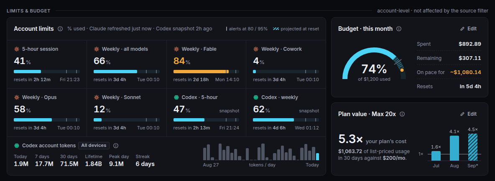

Every Claude and Codex limit in one grid, as **% used** with tick marks at your alert
thresholds, a striped **projection at reset** and a live reset countdown. Beside it, a
**budget** gauge with a pace marker and the **plan value** card, both set inline. A
limit that crosses a threshold raises an alert strip above the overview and, if you allow
it, a desktop notification (once per threshold per window). Claude's limits need the
opt-in [account meters](#account-meters-opt-in); Codex's come from its own logs.
Details: [Limits, alerts and budgets](docs/limits-and-budgets.md).

### Spend

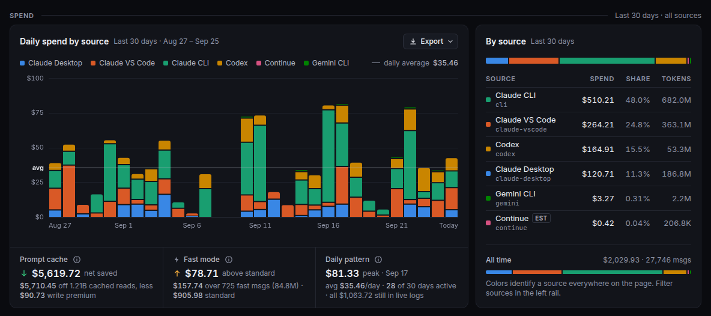

The daily chart stacked by source, with a daily-average line; hover, tap or use the arrow
keys to read a day. The **By source** table shows each source's spend, share and tokens
(Continue's local estimates are badged `EST`). The strip below shows what prompt caching
saved you after the cost of cache writes, what fast mode cost above standard rates, and
your daily pattern. **Export** downloads CSV or JSON for the selected period and sources.

### Breakdown


**By model** with provider marks, an effort-mix bar and a fast-mode count; **By effort**
from `low` to `max`, plus ultracode and default; **By project** by working directory.
Effort levels are read from your transcripts with no setup (see
[How it works](docs/how-it-works.md#reasoning-effort)).

### Activity

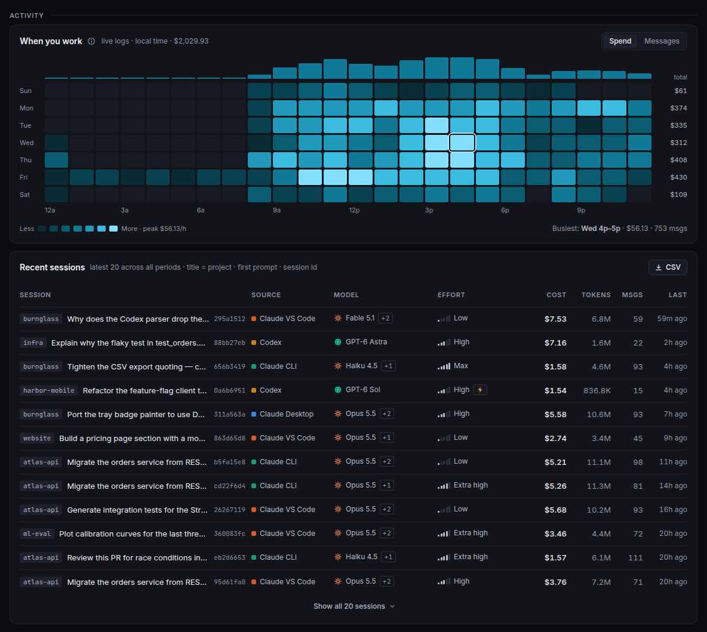

**When you work** shades a weekday × hour grid by spend or by messages, so your busiest
hours stand out. **Recent sessions** lists each session with its project and first prompt,
source, models, effort, cost, tokens, messages and when it was last active.

### Meshy credits (opt-in)

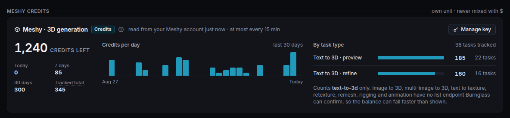

For [Meshy](https://www.meshy.ai) 3D generation: credits left, credits used today and over
7 and 30 days, a daily row and a split by task type. Credits stay credits and never mix
into your dollar totals. Turn it on in **System** and paste an API key; the key is sent
only to `api.meshy.ai` and is never shown back.

### System

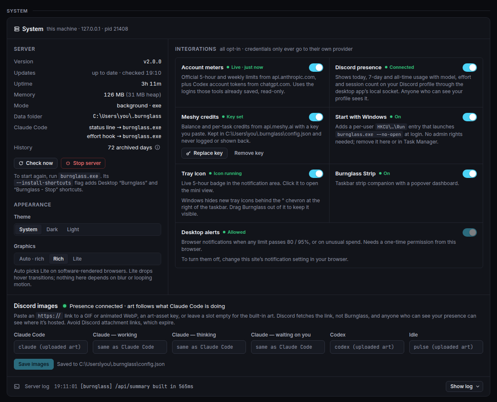

Everything you'd otherwise need a console for: version and update status, uptime,
memory, the data folder, which exe your Claude Code status line and effort hook run,
**Check now**, one-click **Update**, **Stop server** and the live log. It's also where
every opt-in lives: account meters, Discord presence and its images, Meshy, desktop
alerts, and on Windows start with Windows, the tray icon and Burnglass Strip. Updates
are sha256-verified, swapped in with rollback, and reload the page on the new version.

### Full width, all the way to 4K

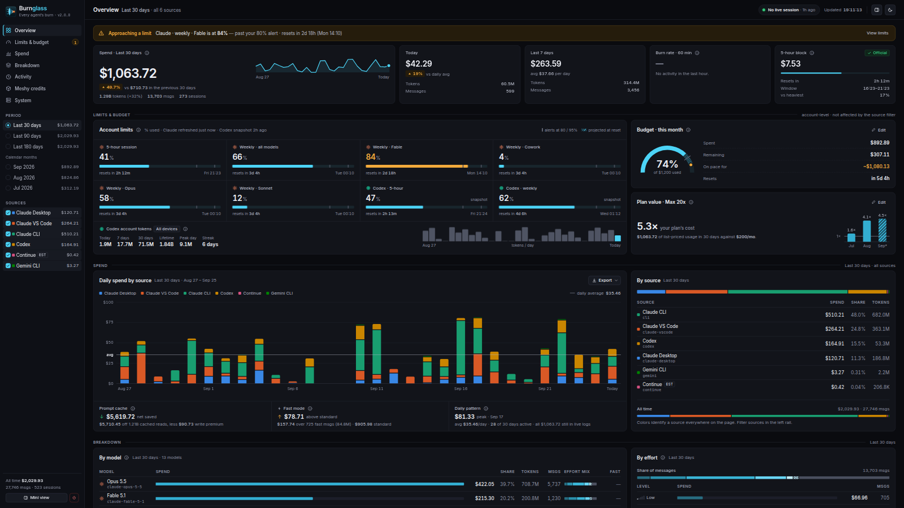

The page fills the window at every width, with no content column and no empty band on a
wide or 4K screen. Sections spread across a 12-column grid and the heatmap cells grow
with the space.

### Mini view and phones

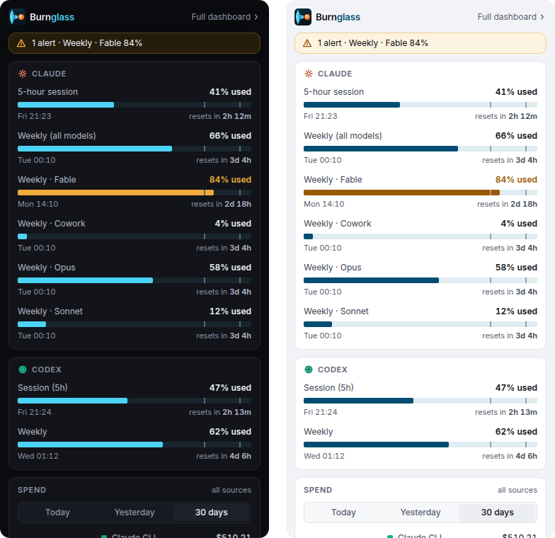

**Mini view** (the rail button, or `/#mini`) shows each limit as **% used** on the same
bars as the dashboard, with a Today / Yesterday / 30 days spend donut by source and a
daily trend. It's sized for a narrow docked window, the tray's app window or a browser
side panel.

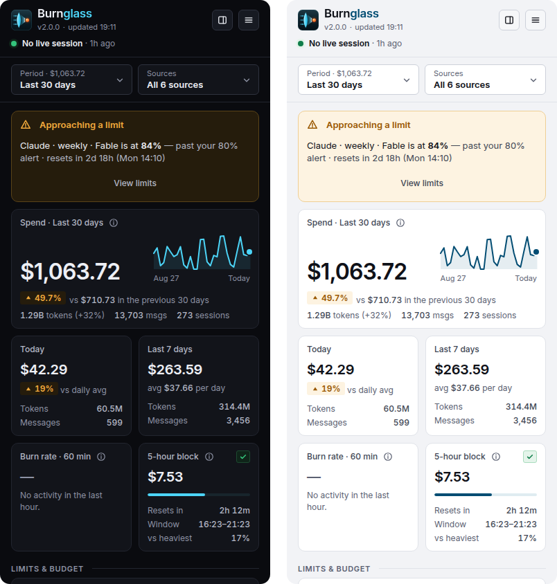

Under 1024 px the rail becomes a compact header, and the period, source and menu buttons
open bottom sheets. The layout works down to 360 px with no sideways scrolling.

## 🪟 Beyond the browser

### Burnglass Strip

<table>
  <tr>
    <td align="center">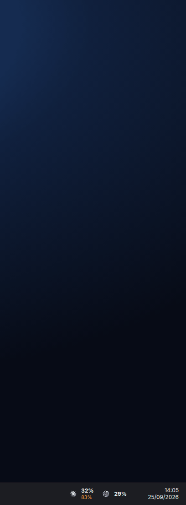</td>
    <td align="center">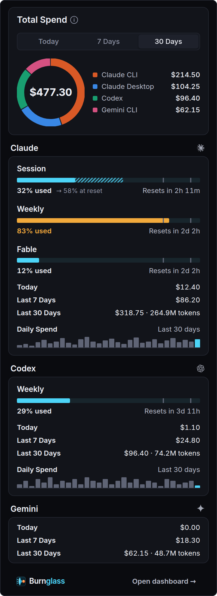</td>
  </tr>
</table>

A slim transparent strip on the Windows taskbar with each provider's **% used**
(alternating with its 30-day spend), turning amber at your first alert threshold and red
at the last (80% / 95% by default). Click it for a popover in the dashboard's look: limit bars with threshold ticks, projections and
reset countdowns, a spend donut by source and daily trend bars. It opens like a Windows 11
flyout, and a one-click update of Burnglass updates the strip too. Opt-in: tick it in the
installer or download `burnglass-strip.exe`, then switch it on in **System**.
Details: [Windows guide](docs/windows.md#burnglass-strip).

### Tray icon

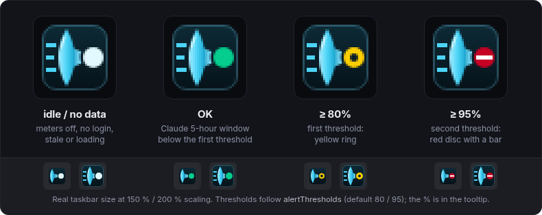

An opt-in Windows notification-area icon whose status follows your Claude 5-hour window.
**Shape carries the state**, so it reads without colour: an ice dot at rest or without
data, a solid green dot below your first alert threshold, a yellow ring from the first
threshold and a red barred disc from the second (your `alertThresholds`, 80 / 95 by
default). The tooltip shows today's spend and your 5-hour and weekly %; left-click opens
the mini view. If the icon can't start, **System** says why and offers **Retry**.
Details: [Windows guide](docs/windows.md#tray-icon).

### Discord Rich Presence

Show your usage as a Discord activity that rotates through **Today**, **Past 7 days** and
**All-time** (tokens and spend), with a second line such as *Opus 5.5 · Extra High ·
3 sessions* while you work. The large image follows what Claude Code is doing, and it can
be an **animated GIF**. Here's a ready-made set of Clawd GIFs, one per state:

| Working | Thinking | Waiting on you | Idle |
| :-: | :-: | :-: | :-: |
|  |  |  |  |
| [512 px GIF](.github/assets/discord/working-512.gif) | [512 px GIF](.github/assets/discord/thinking-512.gif) | [512 px GIF](.github/assets/discord/waiting-512.gif) | [512 px GIF](.github/assets/discord/idle-512.gif) |

| Clawd | Shown when | System → Discord images | Config key |
| --- | --- | --- | --- |
| Working | Claude is running a tool, or its subagents are | Claude — working | `discordClaudeWorkingImage` |
| Thinking | The model is generating | Claude — thinking | `discordClaudeThinkingImage` |
| Waiting on you | A permission prompt or a question is open | Claude — waiting on you | `discordClaudeWaitingImage` |
| Idle | Claude Code is your active tool but not mid-turn; also fills any state slot you leave empty | Claude Code | `discordClaudeImage` |


The sleeping Clawd goes in the **Claude Code** slot. The dashboard's separate **Idle**
slot (`discordLargeImage`) is shown once neither Claude Code nor Codex has been active
for 15 minutes; the hand-drawn **pixel Clawd** made for Burnglass (right) suits it, or
any other slot.

**Use them:** Discord animates an image only when it's an `https://` link (uploaded art
assets are always stills). Host the 512 px GIFs anywhere public, such as a free
[Cloudflare Pages](https://pages.cloudflare.com) site, then paste each link into
**System → Discord images** and click **Save images**. Presence is opt-in and needs the
Discord desktop app; Burnglass talks to it over its local socket. Step-by-step:
[Discord guide](docs/discord.md).

<sub>The four state GIFs are rendered from [clawd-tank](https://github.com/marciogranzotto/clawd-tank)
by marciogranzotto (MIT, [licence](.github/assets/discord/LICENSE-clawd-tank.txt)). Clawd is
Anthropic's character; all of these GIFs, the pixel Clawd included, are unofficial fan art, not affiliated with or endorsed by Anthropic.</sub>

### Claude Code status line

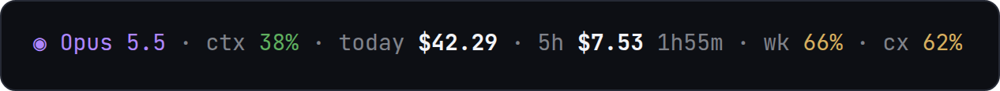

The model and context come from Claude Code; today's spend across every tool, the
current 5-hour block and your limit percentages (`cx` = Codex weekly) come from the
running Burnglass server, so the status line never calls a provider itself. Run
`burnglass --statusline-setup` and paste the printed snippet into
`~/.claude/settings.json` (Burnglass never edits it for you):

```json
{
  "statusLine": {
    "type": "command",
    "command": "…/burnglass --statusline",
    "padding": 0,
    "refreshInterval": 30
  }
}
```

It's fail-open: if Burnglass isn't running, the line still shows the model and context,
and it always exits cleanly (a status-line command that errors would blank the line).
`NO_COLOR=1` turns the colours off.

### Terminal summary

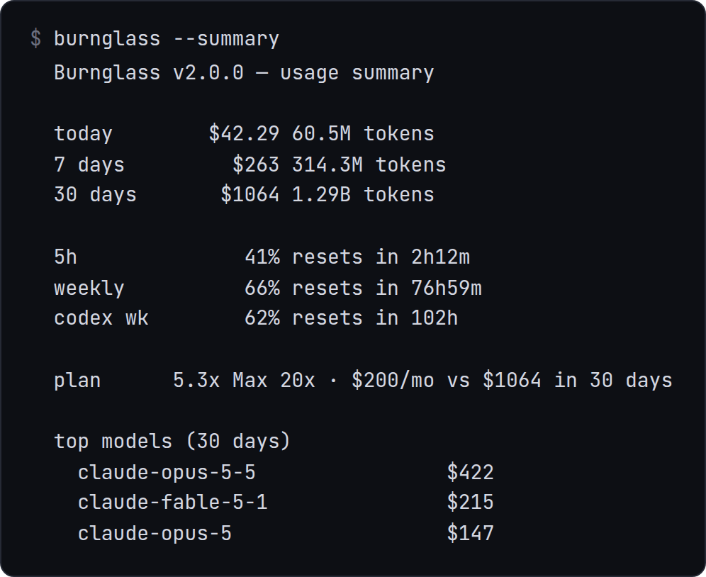

`burnglass --summary` prints today / 7-day / 30-day spend and tokens, your limits with
reset countdowns, your plan multiple and your top models, then exits. It reads the
running server when there is one and computes locally when there isn't, respects
`NO_COLOR`, and always exits 0, so it's safe in a prompt or a script.

## 📡 What it reads

### Claude Code and Codex

Claude Code's transcripts (`~/.claude/projects`) and Codex's rollouts (`~/.codex/sessions`)
are read automatically. Claude Code usage is split by where it ran (CLI, VS Code,
JetBrains, Claude Desktop, SDK), and Codex subagents, the auto-reviewer and `/review` are
grouped under their parent session. Each entry is priced at its provider's list price on
the entry's own date. Codex's own limit windows appear in **Limits** without any login.
Details: [How it works](docs/how-it-works.md).

### Account meters (opt-in)

Your Pro / Max limits are shared by every surface: claude.ai, the mobile apps, other
computers. Local logs can't see those, but Anthropic's account-wide meter can. Turn on
**Account meters** in **System** and Burnglass shows the same bars as `/usage`, with
true reset times; with a Codex login it also shows your ChatGPT account's real token
counts across all devices. The login token is read read-only and sent only to its own
provider. Details: [Limits, alerts and budgets](docs/limits-and-budgets.md#account-meters).

### More agents

| Agent | What Burnglass reads | Cost |
| --- | --- | --- |
| **Gemini CLI** | `~/.gemini/tmp/*/chats/session-*.jsonl` | Google Gemini API list prices |
| **Continue** | `~/.continue/dev_data/*/tokensGenerated.jsonl` | Continue's own **local token estimates**, badged `est` |
| **Cline** | the extension's task history (`globalStorage/saoudrizwan.claude-dev/tasks/`) | Cline's own recorded cost |
| **Roo Code** | the same layout under `rooveterinaryinc.roo-cline` / `.roo-code` | Roo's own recorded cost |

Each appears as its own source only when its logs exist. Cline and Roo are found in
VS Code, Insiders, VSCodium, Cursor and Windsurf, plus `~/.vscode-server` on Linux.
Agents that keep usage only in SQLite (Crush, Goose, opencode ≥ 1.16) aren't supported,
because reading SQLite would break the zero-dependency rule.

### Custom sources

Running your own model or agent? Have it append one JSON line per request to a file and
declare it in `~/.burnglass/config.json`:

```json
{
  "customSources": [
    { "name": "foreman", "label": "FOREMAN", "path": "/home/you/.foreman/usage.jsonl" }
  ]
}
```

It becomes a first-class source with its own filter, colour, chart series, export column
and history. Records without a `cost` count tokens at $0. Full schema:
[Custom sources](docs/custom-sources.md).

## 🔒 Privacy

- Burnglass binds to `127.0.0.1` and only ever **reads** `~/.claude`, `~/.codex`, the
  other agents' logs and your custom-source files.
- It writes only to `~/.burnglass`, plus the Windows entries you ask for (installer,
  shortcuts, start with Windows) and its own executables when you update. After an
  upgrade from Pulse, `~/.pulse` is kept as a backup with a few compatibility writes.
- **No usage data ever leaves your machine.** The only default network calls are the
  GitHub update check and the public download and star counters, which read public data
  and send nothing about you. `--no-update-check` turns them off. Account meters, Meshy
  and Discord are opt-in.

The full list of files and network calls: [Privacy & security](docs/privacy-security.md).

## 🚀 Quick start

### Download (no Node required)

Grab the latest release from **[Releases](https://github.com/ReFxFrank/Burnglass/releases/latest)**:

| Platform | Get running |
| --- | --- |
| **Windows (installer)** | Run `BurnglassSetup.exe`: a per-user install (**no admin**) with Start Menu and optional Desktop shortcuts, an Add/Remove Programs entry, and opt-in boxes for **start at sign-in** and **include Burnglass Strip**. It upgrades a Pulse install in place, and uninstalling keeps your settings and history. |
| **Windows (portable)** | Put `burnglass.exe` in a permanent folder and double-click it. Burnglass starts in the background and opens `http://localhost:4747`. Optional: `burnglass.exe --install-shortcuts` adds **Burnglass** and **Burnglass - Stop** to your Desktop. |
| **Linux** (x64) | `chmod +x burnglass-linux && ./burnglass-linux` |
| **macOS** (Apple Silicon) | `chmod +x burnglass-macos && xattr -d com.apple.quarantine burnglass-macos; ./burnglass-macos` (the `xattr` clears Gatekeeper's quarantine on the unsigned binary) |
| **Burnglass Strip** (Windows) | `burnglass-strip.exe`, next to `burnglass.exe` (or tick it in the installer). |

The binaries are unsigned, so SmartScreen may warn on Windows: click **More info → Run
anyway**. Starting again while Burnglass runs just opens the dashboard.

Burnglass finds each tool's logs for whoever runs it (`~/.claude` or `CLAUDE_CONFIG_DIR`,
`~/.codex` or `CODEX_HOME`, and the other agents' default locations). There's nothing to
configure.

> Every release also carries `pulse.exe`, `pulse-linux`, `pulse-macos` and
> `pulse-strip.exe`: byte-identical copies of the Burnglass files, there so Pulse 1.x
> installs can update themselves in one click. New installs should take the
> `burnglass-*` names.

### Run from source

Node ≥ 18, zero runtime dependencies; the built frontend is committed:

```sh
git clone https://github.com/ReFxFrank/Burnglass && cd Burnglass
node server.js          # → http://localhost:4747
```

Building the frontend and executables: [Development](docs/development.md).

### Ubuntu VPS (one command)

```sh
curl -fsSL https://raw.githubusercontent.com/ReFxFrank/Burnglass/main/install.sh | bash
```

This installs a systemd service bound to `127.0.0.1` that restarts on failure and starts
on boot. The dashboard exposes usage metadata, so it's deliberately **not**
internet-facing; reach it over an SSH tunnel:

```sh
ssh -N -L 4747:localhost:4747 <you>@<your-vps-ip>
```

Manage it with `sudo systemctl status|restart burnglass` and `journalctl -u burnglass -f`.
Re-running the installer updates and restarts it. Overrides: `BURNGLASS_PORT`,
`BURNGLASS_HOST`, `BURNGLASS_DIR`, `BURNGLASS_BRANCH`, `CLAUDE_DIR` (the old `PULSE_*`
names still work). A server first installed as Pulse keeps its `~/pulse` checkout and its
`pulse.service` name, so use `pulse` in those commands there.

## 🔁 Upgrading from Pulse

Click **Update now** in Pulse, or run `BurnglassSetup.exe` over a Pulse install, and
everything carries over:

- Your settings, budget, plan cost, history, Meshy task cache, effort sidecar, Discord
  timer and strip state are **copied** from `~/.pulse` to `~/.burnglass` the first time
  the new server starts. `~/.pulse` is kept as a backup and never moved or deleted.
- A self-updated `pulse.exe` keeps its name and path, so your Claude Code **status line
  and effort hook** keep working, and so does **start with Windows**.
- Port 4747, every CLI flag, the `/api` routes, the `X-Pulse` header, your browser
  preferences and every `PULSE_*` variable still work (`BURNGLASS_*` wins when both are set).

What happens to each file and setting: [Upgrading from Pulse](docs/upgrading-from-pulse.md).

## 📚 Documentation

| Guide | What's in it |
| --- | --- |
| [Configuration](docs/configuration.md) | Every `config.json` key, command-line flag and environment variable. |
| [Limits, alerts and budgets](docs/limits-and-budgets.md) | Account meters, Codex meters, limit and anomaly alerts, budget goals, plan value. |
| [Discord Rich Presence](docs/discord.md) | Setup, the image slots, live Claude states, hosting animated GIFs, the Clawd gallery. |
| [Windows guide](docs/windows.md) | Installer, `--install`, start with Windows, background mode, the tray icon and its diagnostics, Burnglass Strip. |
| [Custom sources](docs/custom-sources.md) | Bring your own agent: config, the record schema, rotation and dedup. |
| [How it works](docs/how-it-works.md) | Parsing, pricing and accuracy, reasoning effort, 5-hour blocks, history, what Burnglass can and can't see. |
| [Privacy & security](docs/privacy-security.md) | What's read, what's written, every network call, request hardening. |
| [HTTP API](docs/api.md) | Every route, the export formats and the request rules. |
| [Upgrading from Pulse](docs/upgrading-from-pulse.md) | What the v2.0 rename changes and what it keeps. |
| [Development](docs/development.md) | Running from source, building, tests and the repository layout. |

## 📝 License and credits

[MIT](LICENSE): do what you like, no warranty. Not affiliated with Anthropic.

Burnglass Strip is ported from [openusage-windows](https://github.com/CheesyPoofs346/openusage-windows)
(MIT, see [`strip/LICENSE-openusage`](strip/LICENSE-openusage)); their strip design is
excellent. The Discord Clawd GIFs are rendered from
[clawd-tank](https://github.com/marciogranzotto/clawd-tank) (MIT, see
[`LICENSE-clawd-tank.txt`](.github/assets/discord/LICENSE-clawd-tank.txt)).
