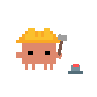
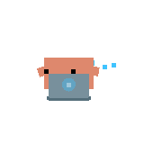
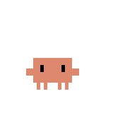
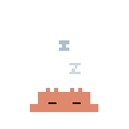
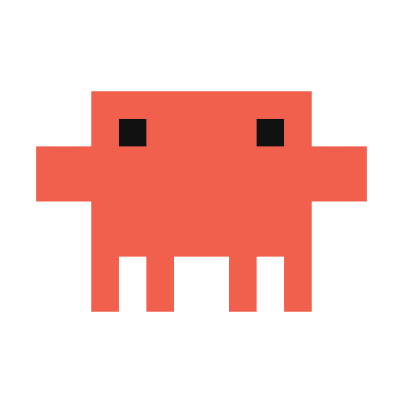

# Discord Rich Presence

Show your usage as a Discord activity, with animated art that follows what Claude Code is doing.

[← Back to the README](../README.md) · [All docs](README.md)

---

## What it shows

The activity rotates through three pages, one every 45 seconds (`discordRotateSecs`,
15 to 300):

- **Today:** 80.0M tokens · $136
- **Past 7 days:** 500M tokens · $980
- **All-time:** 2.69B tokens · $2,581

While you're working, a second line shows your model, effort and live session count,
for example **Opus 5.5 · Extra High · 3 sessions**, or for Codex **GPT-6 Sol · High ·
1 session**. The model and effort come from your main conversation, so subagents and
advisor calls never make it flicker. A session counts as live if it had activity in the
last 15 minutes, and the line disappears when you go idle. `{"discordShowModel": false}`
hides it.

The activity has a **Get Burnglass** button, and its elapsed timer carries on across
self-updates and quick restarts instead of starting from zero.

## Turn it on

1. Make sure the **Discord desktop app** is running. Browser Discord has no local socket,
   so presence needs the app.
2. In the dashboard, open **System** and switch **Discord presence** on. The row turns
   *Connected*.

That's all. Burnglass ships with the official Burnglass application ID built in (a public
identifier, which is how every rich-presence tool works). To present as your own Discord
application instead, set `{"discordClientId": "…"}`.

## Images that follow what you're doing

The large image shows Claude art while you use Claude Code, Codex art while you use
Codex, and Burnglass art when you're idle. For Claude it also follows the live state:

| State | When | Dashboard slot | Config key |
| --- | --- | --- | --- |
| **Working** | Claude is running a tool, or its subagents are | Claude — working | `discordClaudeWorkingImage` |
| **Thinking** | The model is generating | Claude — thinking | `discordClaudeThinkingImage` |
| **Waiting on you** | A permission prompt or a question is open | Claude — waiting on you | `discordClaudeWaitingImage` |
| **Claude Code** | Claude Code is your active tool but not mid-turn; an image you set here also fills any state slot you leave empty | Claude Code | `discordClaudeImage` |
| **Codex** | Codex is your active tool | Codex | `discordCodexImage` |
| **Idle** | Neither Claude Code nor Codex has been active for 15 minutes | Idle | `discordLargeImage` |

**Built-in art (since v2.0.1):** with nothing set, the four Claude slots show the
animated Clawd below (hammering, typing, "!", asleep); Codex shows the OpenAI mark and
Idle the Burnglass mark. The Clawd GIFs are `https://` links to the 512 px files in this
repository, pinned to the `v2.0.0` tag so they never change
(`https://raw.githubusercontent.com/ReFxFrank/Burnglass/v2.0.0/.github/assets/discord/<state>-512.gif`).
Discord's media proxy loads them; Burnglass itself makes no request. For a Claude state,
the order is: that state's own slot, then your **Claude Code** image, then the built-in
Clawd. `"discordShowState": false` turns live state off and shows the static `claude`
art instead.

With presence on, **System → Discord images** has a field for each slot. Each field takes
an **art-asset key** or an **`https://` link**; an empty field falls back to the built-in
art. Click **Save images** and the new art is published straight away.

- **How the state is read:** Burnglass reads Claude Code's own live status files
  (`~/.claude/sessions/`, read-only) plus the transcript, and falls back to the
  transcript alone on older Claude Code builds.
- **No flicker:** Claude switches between working and thinking every few seconds, and
  each image swap makes viewers reload a GIF. So a switch between those two must hold for
  45 seconds before the image changes; *waiting* and *idle* switch at once.
- **Codex** shows *working* or *thinking* in the image's hover text, but has no per-state
  images.
- `{"discordShowState": false}` turns the state-following images and hover text off.

## Animated GIFs: the Clawd set

Discord animates a GIF or animated WebP only when it's given as an **https link**.
Uploaded art assets are always stills. Here's a ready-made set, one per Claude state:

| Working | Thinking | Waiting on you | Idle |
| :-: | :-: | :-: | :-: |
|  |  |  |  |
| [working-512.gif](../.github/assets/discord/working-512.gif) | [thinking-512.gif](../.github/assets/discord/thinking-512.gif) | [waiting-512.gif](../.github/assets/discord/waiting-512.gif) | [idle-512.gif](../.github/assets/discord/idle-512.gif) |
| 1 s loop | 12 s loop | 4 s loop | 18 s loop |
| Claude — working | Claude — thinking | Claude — waiting on you | Claude Code |



**Pixel Clawd** ([clawd-pixel.gif](../.github/assets/discord/clawd-pixel.gif), 512 px): a
separate hand-drawn Clawd made for Burnglass. It blinks, shuffles its legs and throws both
claws up (3.6 s loop). It works in any slot, for example **Idle**.

The last row names the slot each GIF goes in. The sleeping Clawd is Claude between turns,
so it belongs in **Claude Code**, not in the separate **Idle** slot.

All the GIFs are transparent and loop forever. Use the **512 px** files for Discord; the
160 px copies above are previews. More about how they were made:
[`.github/assets/discord/README.md`](../.github/assets/discord/README.md).

### Use your own copies (optional)

You don't need this for the Clawd set: it's built in. Host your own copies (or any other
art) when you want full control over the files. Discord's image proxy has to fetch each
GIF from a public `https://` address.

1. **Download** the 512 px GIFs you want (the links in the table; on GitHub, use the
   download button on each file's page) into one folder, for example `clawd/`.
2. **Publish the folder.** Any static host that serves the files directly works. With
   [Cloudflare Pages](https://pages.cloudflare.com) (free): in the Cloudflare dashboard,
   create a Pages project, choose to upload your assets directly, and drop the folder in.
   Or from a terminal:

   ```sh
   npx wrangler pages deploy clawd --project-name my-clawd
   ```

   (Wrangler asks you to log in to Cloudflare the first time.) Your links then look like
   `https://my-clawd.pages.dev/working-512.gif`. GitHub Pages works the same way.
3. **Check** each link: opened in a browser, it should show the GIF itself, not a web page.
4. **Paste** each link into its slot in **System → Discord images** (or set the config
   keys above) and click **Save images**.

Link rules: it must start with `https://`, contain no spaces or embedded
username / password, and be at most 256 characters. An art-asset key is letters, digits,
`_`, `.` and `-` (Discord lowercases keys). One bad value rejects the whole save,
so nothing is half-applied. Avoid Discord attachment links, because they expire.

The dashboard deliberately shows no preview of your links: rendering one would make the
dashboard fetch it. Discord fetches the image, not Burnglass, and **anyone who can see
your presence can see where the image is hosted**. If Discord rejects an image, **System**
shows the error until the next accepted update.

### Credits

The four state GIFs are rendered from the animated SVGs in
[marciogranzotto/clawd-tank](https://github.com/marciogranzotto/clawd-tank), which is
MIT-licensed ([licence text](../.github/assets/discord/LICENSE-clawd-tank.txt)). Clawd is
Anthropic's character; all of these GIFs, the pixel Clawd included, are unofficial fan art
and are not affiliated with or endorsed by Anthropic.

## Built-in art and your own application

The built-in keys `claude`, `codex` and `pulse` name art uploaded to the Burnglass Discord
application (the idle key is still called `pulse` from before the rename; it now holds
the Burnglass art). If you use your own application ID, upload images under those keys in
the Discord Developer Portal (your application → Rich Presence → Art Assets), or put
links in the slots. A key that doesn't exist just shows no image.

## How it works and privacy

- Burnglass speaks the Discord **desktop app's local IPC socket** directly (a named pipe
  on Windows, a Unix socket elsewhere, including the Snap and Flatpak locations), with no
  SDK and no network traffic from Burnglass. The Discord app does the publishing.
- It updates at most every 15 seconds, and only when something changes. If Discord
  isn't running yet or restarts, Burnglass keeps retrying and reconnects on its own.
- **Your presence is visible to anyone who can see your Discord profile.** That's the
  point, but it's why presence is off by default. Turn it off at any time and the
  activity clears at once.

## Config keys

| Key | Default | Effect |
| --- | --- | --- |
| `discordPresence` | off | The switch in **System**. |
| `discordClientId` | Burnglass's app | Present as your own application. |
| `discordRotateSecs` | `45` | Seconds per page, 15 to 300. |
| `discordShowModel` | on | `false` hides the model · effort · sessions line. |
| `discordShowState` | on | `false` turns off the state-following images and hover text. |
| `discordClaudeImage` · `discordClaudeWorkingImage` · `discordClaudeThinkingImage` · `discordClaudeWaitingImage` · `discordCodexImage` · `discordLargeImage` | built-in art (Claude slots: the animated Clawd) | One art-asset key or `https://` link per slot (see the table above). |

The dashboard's **Save images** button uses `POST /api/discord/images`; see the
[HTTP API](api.md).
